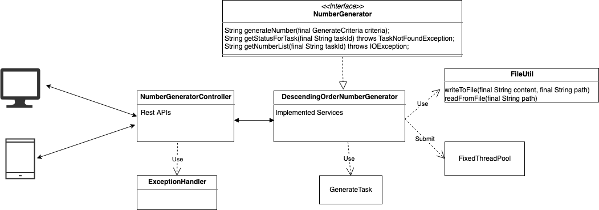

# Number Generator

A simple number generator Spring boot application. Current implementation will 
generate number in descending order till 0 for given goal and step to decrement.

    POST
    /api : Submit a task to generate number for given goal generate criteria.
        
        Request body:
        {
          "goal": 10,
          "step": 2
        }
        
        Response body:
        {
          "task": "777302d0-ba9f-4c3b-83b1-fa0837f8eda0"
        }
    
    
    GET 
    /api/tasks/{taskId} : Return the list of generated numbers
    
        Request URL: http://localhost:8080/api/tasks/777302d0-ba9f-4c3b-83b1-fa0837f8eda0?action=get_numlist
        Response Body: 10,8,6,4,2,0             
    
    
    GET
    /api/tasks/{taskId}/status : Return the status for given taskId
    
        Request URL:http://localhost:8080/api/tasks/777302d0-ba9f-4c3b-83b1-fa0837f8eda0/status
        Response body: SUCCESS/IN_PROGRESS/ERROR

- To Run the application
    ```
    cd number-generator
    Check the file location in application.properties file
    mvn spring-boot:run
    ```
  Currently file location is set to '/tmp'. Can be overridden with
  ```
    mvn spring-boot:run -Dspring-boot.run.arguments="--fileLocation=yourlocation"
   ```
- you can also start the ApplicationStarter.java in your editor like eclipse/intellij

- Swagger api is configured

    http://localhost:8080/swagger-ui.html

- To run unit test
    ```
    mvn test
    ```
- If any issue while running contact: kunal.s.rathor@gmail.com

- Diagram


